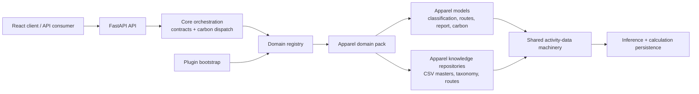
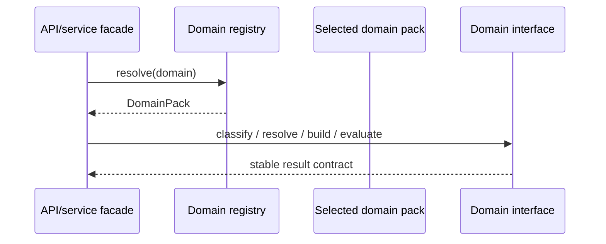

# Architecture V3: Domain-Agnostic Manufacturing Intelligence Platform

## Migration Status

The platform is being migrated incrementally from an apparel LCA prototype to a
domain-agnostic manufacturing intelligence platform. Apparel remains the
reference implementation and is frozen by golden-output regression checks. No
API or calculation behavior is replaced wholesale during this migration.



Dependency direction is deliberate: core depends on contracts only; the plugin
bootstrap knows concrete packs; packs own domain knowledge and calculation
rules. `app/core` must never import `domain_packs.apparel`.

## Folder Structure

```text
backend/
├── app/
│   ├── core/                 # DomainPack/CarbonModel contracts, registry, dispatch
│   ├── services/             # Domain-neutral orchestration and activity mechanics
│   └── main.py               # Stable HTTP API and domain request resolution
├── domain_packs/
│   ├── bootstrap.py          # Explicit plugin registration point
│   └── apparel/              # Apparel aliases, routes, repositories, carbon rules
└── tests/
    ├── _golden/              # Frozen apparel output baseline
    └── test_ws1_core_boundary.py
data/
├── masters/                  # Audited source/master records
├── Products/ templates/ routes/ # Apparel knowledge repositories (current layout)
├── calculations/             # Runtime calculation output; not source data
└── inference/                # Runtime inference output; not source data
frontend/                     # React client; consumes only public API responses
docs/                         # Architecture, migration and domain governance
```

## Stable Core-to-Domain Contract

| Contract | Owner | Stability rule |
|---|---|---|
| `DomainPack` | `app.core.contracts` | Pack identity, parsing vocabulary, repository locations, transport policy, and `CarbonModel` are supplied by a plugin. |
| `CarbonModel.evaluate(...)` | domain pack | Returns `totals`, `process_breakdown`, `machine_breakdown`, `activity_trace`, and `chemical_inventory`. |
| `ProductIntelligence` | domain pack | Classifies product signals and matches templates for the selected domain. |
| `RouteResolver` | domain pack | Resolves a route and origin context from the selected domain's knowledge. |
| `ReportBuilder` | domain pack | Builds the stable public report from classification, route, and resources. |
| `carbon_engine.evaluate(...)` | `app.core` | Validates the common response shape and dispatches only to the selected pack's model. |
| `register()/resolve()/known()` | `app.core.domain_registry` | Core has no concrete-pack imports; unknown named domains fail explicitly. |
| `load_master_data(pack)` | service layer | Loads/caches the pack's repositories by stable domain ID. |
| `/api/analyze` | API | `domain` is optional for backward compatibility and defaults to Apparel; a named unknown domain returns HTTP 400. |

The common result contract also permits additive metadata such as
`impact_data_quality`; consumers must not depend on undocumented internal
calculation fields.

### Dependency Injection Sequence



## Product Principles

1. Everything is traceable.
2. All emissions originate from activity data.
3. Inference results are stored separately from source data.
4. Confidence is a first-class attribute.
5. The Knowledge Graph drives inference.

## Master Domains

The platform is organized around 12 enterprise master domains:

- Product Master
- Material Master
- Process Master
- Machine Master
- Machine Model Master
- Consumable Master
- Chemical Master
- Country Master
- Supplier Master
- Factory Master
- Transport Master
- Emission Factor Master

Supporting operational domains:

- Product Template
- Material Provenance
- Manufacturing Route
- Route Process
- Process Step
- Machine Energy Profile
- Factory Machine Map
- Yield Model
- Carbon Calculation
- Inference Record

## Data Storage Contract

Master and source records live under `data/masters/`.

Runtime calculation and inference records are stored separately:

- `data/calculations/carbon_calculations.csv`
- `data/inference/inference_records.csv`

Every master dataset supports audit fields:

- `version`
- `effective_date`
- `expiry_date`
- `source`
- `approval_status`
- `confidence`

## API Surface

Implemented endpoints:

- `GET /api/health`
- `GET /api/catalog`
- `GET /api/master-domains`
- `GET /api/knowledge-graph/schema`
- `POST /api/analyze`
- `GET /api/inference-records`
- `GET /api/machine-intelligence`
- `GET /api/workflow`
- `POST /api/machine-spec-extract`
- `GET|POST /api/brochure-review`
- `POST /api/brochure-promote`
- `POST /api/brochure-fetch`
- `GET /api/brochure-coverage`

`POST /api/analyze` returns:

- source document signals
- product taxonomy and template match
- route reconstruction
- process breakdown
- machine model energy breakdown
- activity-data trace
- chemical inventory
- carbon, water, and energy totals
- confidence framework labels
- data-quality labels for energy, water, chemicals, and transport
- digital product passport summary

## Knowledge Graph Schema

Nodes:

- Product
- Material
- Route
- Process
- ProcessStep
- MachineCategory
- MachineModel
- Consumable
- Chemical
- Supplier
- Factory
- Country
- Transport
- EmissionFactor

Relationships:

- Product CONTAINS Material
- Material FOLLOWS Route
- Route HAS_PROCESS Process
- Process HAS_STEP ProcessStep
- Process USES MachineCategory
- MachineCategory HAS_MODEL MachineModel
- MachineModel CONSUMES Consumable
- Factory OWNS MachineModel
- Country HAS EmissionFactor
- Transport USES EmissionFactor

## Confidence Framework

- Level 1: Primary Data, 95-99%
- Level 2: Supplier Data, 80-95%
- Level 3: Trade Data, 70-85%
- Level 4: Industry Average, 50-75%
- Level 5: Fallback Logic, 25-50%

## Machine Energy Strategy

Machine energy reconstruction is modeled through:

- `Machine_Category`
- `Machine_Model`
- `Machine_Energy_Profile`
- `Factory_Machine_Map`

The current seed includes representative machine models:

- Thies iMaster H2O
- Mayer & Cie Relanit
- Rieter G 38
- Juki DDL-8700

Their energy profiles currently use KG V2 proxy values and are marked `Pending Brochure Review`.
Public brochures and datasheets should be attached before these records are promoted to supplier or primary-data confidence levels.
