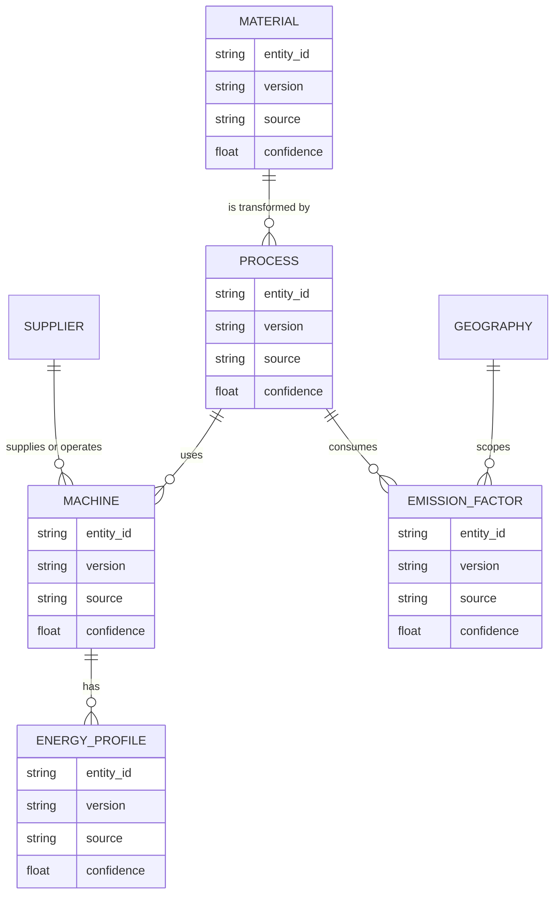

# Generic Knowledge Platform V1

## Purpose

The Knowledge Platform provides one domain-neutral governance envelope for
manufacturing knowledge. Domain packs continue to own their source masters and
calculation rules; the platform exposes those records as canonical entities for
search, verification, provenance, and future persistence.

## Canonical Entity Contract

Every `KnowledgeEntity` has:

| Field | Meaning |
|---|---|
| `entity_type`, `entity_id`, `domain_id` | Stable identity and domain ownership. |
| `version`, `effective_date`, `expiry_date` | Version and validity period. |
| `source`, `evidence` | Source assertion plus one or more provenance records. |
| `confidence`, `approval_status` | Domain-owned evidence quality and governance state. |
| `attributes` | Entity-specific, lossless master fields. |

V1 entity types are `material`, `process`, `machine`, `supplier`, `geography`,
`energy_profile`, and `emission_factor`.



## Repository Contract

`KnowledgeRepository` is read-only in V1:

```python
get(entity_type, entity_id) -> KnowledgeEntity | None
list(entity_type=None) -> list[KnowledgeEntity]
provenance(entity_type, entity_id) -> tuple[Evidence, ...]
```

`MasterDataKnowledgeRepository` adapts existing domain master rows into the
canonical envelope. It does not replace `load_master_data`, mutate CSVs, or
change calculation indexes. This protects frozen Workstream 1 and 2 behavior.

## Verification Pipeline


The verifier is offline and read-only. It checks identity, domain, version,
source, provenance evidence, approval status, effective date, and confidence
range. It returns both:

- `source_confidence`: the unchanged confidence asserted by the domain master;
- `structural_confidence`: 70% source confidence plus 30% governance-envelope
  completeness.

Structural validity means the audit envelope is complete; it does not turn a
proxy into primary data or override approval status.

## Apparel Migration Mapping

| Canonical type | Existing Apparel master | Identifier |
|---|---|---|
| `material` | `materials.csv` | `material_id` |
| `process` | `processes.csv` | `process_id` |
| `machine` | `machine_models.csv` | `machine_model_id` |
| `supplier` | `suppliers.csv` | `supplier_id` |
| `geography` | `countries.csv` | `country_id` |
| `energy_profile` | `machine_energy_profiles.csv` | `machine_model_id` |
| `emission_factor` | `emission_factors.csv` | `factor_id` |

The migration is a read-only adapter. Existing Apparel IDs, versions, sources,
approval statuses, confidence values, and calculation behavior remain exactly
as authored in the master files.
