# Product Digital Twin V1

## Purpose

`ProductDigitalTwin` is the canonical, versioned aggregate for one product
analysis. Services enrich its sections in lifecycle order instead of owning
separate competing product state. Existing API fields remain available during
Workstream 2; the twin is an additive public representation.

## Schema

| Field | Meaning |
|---|---|
| `twin_id` | Immutable run identity (`TWIN-*`). |
| `schema_version` | Contract version; V1 is `1.0`. |
| `domain_id` | Registered domain pack selected for the run. |
| `version` | Starts at 1 and increments on every enrichment. |
| `lifecycle_stage` | Last completed lifecycle stage. |
| `sections` | Canonical service outputs. |
| `history` | Append-only section ownership/version history. |

## Lifecycle and Ownership

```mermaid
flowchart LR
    Intake["API intake\ninput"] --> Signals["Document Intelligence\nsignals"]
    Signals --> Product["Product Intelligence\nclassification + template"]
    Product --> Route["Route Resolver\nroute + origin context"]
    Route --> Resource["Carbon/Resource Engine\nresources"]
    Resource --> Report["Report Builder\nreport"]
    Report --> Trace["Inference Engine\ninference trace"]
    Trace --> Enrich["Machine Workflow + Brochure\noptional enrichment"]
    Enrich --> Persist["Persistence\npersistence receipt"]
```

| Section | Owner | Lifecycle stage |
|---|---|---|
| `input` | API intake | `intake` |
| `signals` | Document Intelligence | `interpreted` |
| `classification`, `template` | `ProductIntelligence` pack interface | `classified`, `templated` |
| `composite_route`, `route`, `origin_context` | `RouteResolver` pack interface | `routed` |
| `resources` | `CarbonModel` through core dispatch | `evaluated` |
| `report` | `ReportBuilder` pack interface | `reported` |
| `inference_trace` | Inference Engine | `traced` |
| `workflow`, `brochure_enrichment` | Optional enrichment services | `enriched` |
| `persistence` | Persistence service | `persisted` |

## Validation Rules

- A twin requires a non-empty registered-domain identifier.
- Only known sections can be enriched.
- An enrichment cannot regress the lifecycle stage.
- `version == 1 + history.length`.
- A final analysis requires signals, classification, template, route, resources,
  report, and inference trace.

## Compatibility and Versioning

V1 does not replace the existing report, inference trace, or persistence
schemas. `twin` is added to `POST /api/analyze`; existing response fields retain
their names and values. Future schema changes must be additive within V1 or
introduce a new schema version with an adapter.
