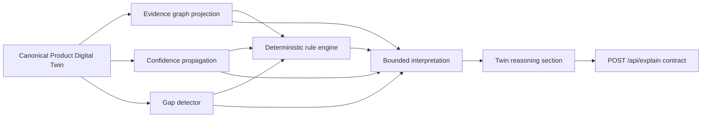
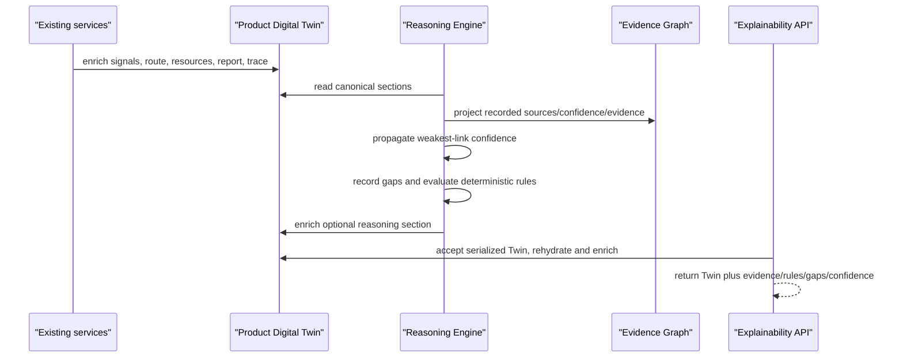

# Workstream 4 — Generic Reasoning and Intelligence Platform

Status: implemented as an additive platform extension. Workstreams 1–3 remain compatible and the existing analysis endpoint is unchanged.

## Scope and invariants

- `ProductDigitalTwin` remains the only persistent mutable aggregate for an analysis run. Reasoning is stored in its optional `reasoning` section.
- The reasoning core imports neither an apparel pack nor apparel knowledge.
- Missing facts become gaps. No service supplies a fallback value for a gap.
- The interpretation layer can restate only evidence IDs, rule outcomes, gap records, and already-recorded confidence scores. It is not an inference source and has no model-provider access.
- Existing Twin consumers do not need to populate `reasoning`; it is optional and excluded from the frozen final-section requirement.

## Reasoning architecture

`ReasoningEngine.evaluate` has no side effects. `ReasoningEngine.enrich` is the single mutation: it writes the evaluated result through `ProductDigitalTwin.enrich(section="reasoning")`, advancing the lifecycle from `traced` to `reasoned` where applicable.

## Evidence graph schema

Each source-bearing, confidence-bearing, or explicitly evidenced Twin claim is projected into an immutable view. IDs are deterministic SHA-256-derived IDs, not domain classifications.

| Field | Meaning |
| --- | --- |
| `evidence_id` | Stable `EV-…` graph node identifier |
| `subject_path` | Canonical Twin path of the claim |
| `claim` | Existing inference/activity/label identifier, never generated fact |
| `source` | Existing source, otherwise the explicit `twin-derived` marker |
| `confidence_score` | Existing bounded score (0–1), or `null` |
| `evidence_refs` | Existing references used by the claim |
| `approval_status` | Existing review state when present |

An edge has `from_id`, `to_id`, and `relation: supports`; it connects an evidence node to its cited reference. The graph is a projection, not a new knowledge repository.

## Confidence model

Confidence is propagated section by section. The model gathers only recorded `confidence.score` values and uses the minimum value (weakest link). A section without scores is `uncovered`; its score and the all-Twin score remain `null` when no confidence is available. No default confidence is assigned.

## Gap detection specification

`GapRule` is declarative: a stable ID, predicate, Twin path, reason, severity, and requested information. The default generic policies identify missing material composition (`GAP-MATERIAL-COMPOSITION`), missing evidenced production origin (`GAP-PRODUCTION-ORIGIN`), and machine energy based on non-manufacturer proxy evidence (`GAP-MACHINE-PRIMARY-DATA`). Each record is `open`; clients must request the stated information or preserve the gap.

This provides the earlier energy/water/chemical/transport proxy policy with a common no-guess mechanism while leaving domain-specific thresholds in the relevant domain pack.

## Rule engine specification

`RuleEngine` takes `RuleDefinition` objects (ID, description, pure predicate) and returns deterministic `passed` or `not_satisfied` outcomes. The initial generic rules check required Twin coverage, confirm weakest-link propagation, and enforce that gaps remain gaps. Rules receive sections, gaps, and confidence; they cannot call a domain pack or mutate a Twin.

## Explainability API specification

The independently mountable FastAPI router is `app.api.explainability.router`. It intentionally does not alter the frozen `/api/analyze` endpoint.

`POST /api/explain` accepts `{ "twin": { …serialized canonical Twin… } }`. Its response contains a re-serialized canonical `twin` whose optional `reasoning` section and top-level `explainability` are identical. The latter contains `evidence_graph`, `confidence`, `gaps`, `rules`, and `interpretation`. Invalid serialized Twin invariants produce HTTP 422.

## AI interpretation boundary

The current `bounded_interpretation` implementation is deliberately provider-free and template-based. Any future AI adapter must receive only the completed reasoning payload and be constrained to cite existing IDs and values. It may explain uncertainty but may not create an entity, source, assumption, confidence score, route, resource value, or emission factor.
