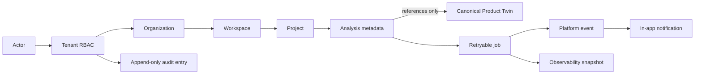
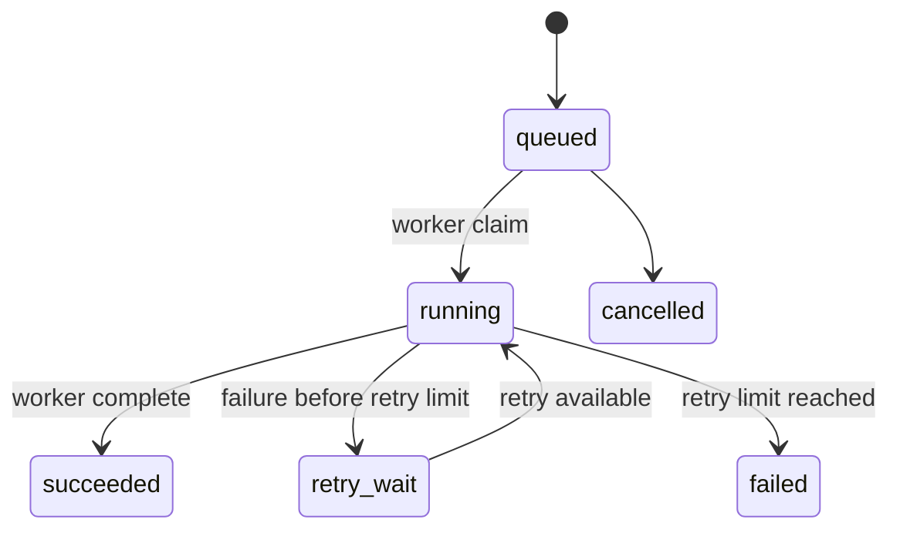

# Workstream 5 — Enterprise and Operations Platform

Status: complete as an additive, domain-neutral control plane. Workstreams 1–4 and their frozen analysis behavior are unchanged.

## Architecture and invariants

Enterprise records are immutable metadata. They identify the tenant, workspace, project, analysis, job, and the canonical `twin_id`; they do not contain a product representation. The Product Digital Twin remains the sole mutable product aggregate.



The initial adapter is a thread-safe, replace-on-write in-memory repository behind the `EnterpriseRepository` port. Production persistence must supply tenant-keyed transactional storage and durable queue leases without changing the domain or Twin services.

## Security model

All resources are organization-scoped and every nested lookup verifies its parent organization:

| Role | Permissions |
| --- | --- |
| Owner | Organization administration, workspaces, projects, analyses, audit/operations, feature flags |
| Admin | Workspace/project/analysis administration, audit/operations, feature flags |
| Analyst | Create projects and run/read analyses |
| Viewer | Read analyses only |

The service checks membership before every protected action. A workspace or project from another organization produces a not-found outcome rather than cross-tenant access. API callers receive 403 for denied permission and 404 for a resource outside their tenant scope.

## Job design

Jobs reference only `analysis_id`, `organization_id`, `workspace_id`, and a generic `job_type`; they do not include domain instructions or a Twin copy.



- Initial maximum attempts defaults to 3 and is bounded to 1–10 at the API.
- A failure applies exponential backoff (`2^(attempt - 1)` seconds) and preserves a truncated error.
- A terminal failure marks the analysis failed and emits an event/notification.
- Completion marks the analysis complete and emits an event/notification.
- A durable worker must claim through a transactional lease in the production repository adapter.

## Audit and governance specification

Every managed change emits an immutable `AuditEntry`: `audit_id`, organization, actor, action, resource type/ID, timestamp, optional request ID, and minimal metadata. Current audited actions cover organization/workspace/project/analysis creation, membership changes, feature configuration, queueing, and worker failure. Audit read access requires `audit:read`.

Audit payloads contain identifiers and operational metadata only—never uploaded source document bytes, analysis output, secrets, or a duplicate Twin.

## Events, notifications, and observability

Events use the immutable `PlatformEvent` envelope (organization, event type, resource, timestamp, payload). The default notification adapter creates in-app pending notifications for terminal analysis outcomes. The operations snapshot exposes tenant-scoped job counts by state plus event, audit, and notification counts. It is intentionally a minimal metrics contract; production should export the same counters and queue age/latency/error metrics to the organization’s telemetry stack.

## Configuration and feature flags

Feature flags resolve in this order: workspace override, organization default, call-site default. Only owner/admin roles can set flags. Flags are tenant metadata and are not allowed to alter domain logic or facts; use them for operational rollouts such as asynchronous execution or notification delivery.

## Operations API specification

The independently mountable router is `app.api.operations.router`; it intentionally does not modify frozen `/api/analyze`.

| Method | Path | Purpose |
| --- | --- | --- |
| POST | `/api/operations/organizations` | Create organization and owner membership |
| POST | `/api/operations/workspaces` | Create tenant workspace |
| POST | `/api/operations/projects` | Create project |
| POST | `/api/operations/analyses` | Register an analysis referring to `twin_id` |
| POST | `/api/operations/analyses/{id}/queue` | Create queued analysis job |
| POST | `/api/operations/jobs/claim` | Atomically claim next available job (adapter scope) |
| POST | `/api/operations/jobs/{id}/complete` | Complete a running job |
| POST | `/api/operations/jobs/{id}/fail` | Fail/retry a running job |
| PUT | `/api/operations/feature-flags` | Set tenant/workspace feature flag |
| GET | `/api/operations/audit` | Read organization audit log |
| GET | `/api/operations/observability` | Read tenant operational counters |

## Integration sequence

```mermaid
sequenceDiagram
  participant A as "Authorized actor"
  participant API as "Operations API"
  participant OP as "Enterprise Operations"
  participant Q as "Job adapter"
  participant W as "Worker"
  participant T as "Canonical Twin"
  A->>API: create analysis(twin_id)
  API->>OP: RBAC + tenant validation
  OP-->>API: immutable analysis metadata
  A->>API: queue analysis
  OP->>Q: queued job + audit/event
  W->>Q: claim job
  W->>T: enrich Twin through frozen pipeline
  W->>OP: complete or fail job
  OP-->>A: event/notification; audit and metrics update
```
