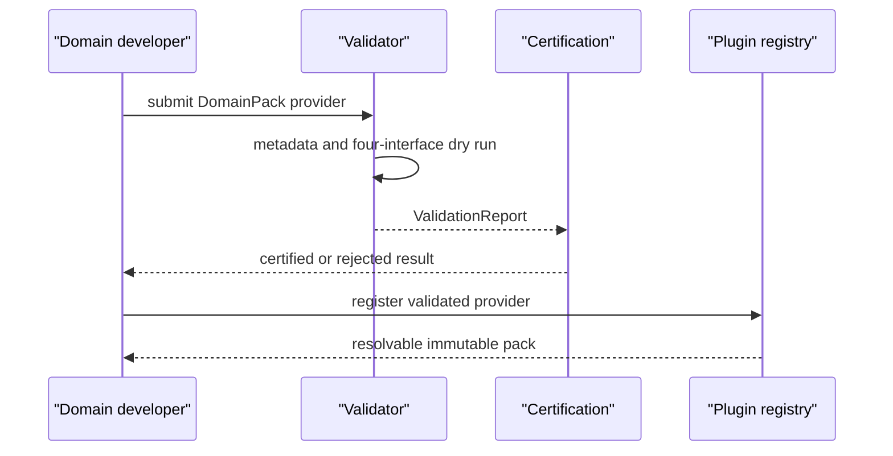

# Workstream 6 — Domain SDK and Onboarding Framework

Status: complete. The SDK is a developer-facing layer over the frozen Workstream 1 contracts; it does not alter core, current domain packs, or analysis behavior.

## SDK architecture

```mermaid
flowchart LR
  D["Domain developer"] --> S["domain_sdk scaffold"]
  S --> P["Independent domain pack"]
  P --> V["validate_pack"]
  V --> C["certify_pack"]
  C --> R["register_domain_plugin"]
  R --> G["Frozen domain registry"]
  G --> K["DomainPack contract"]
  K --> Core["Generic core services"]
```



The public SDK is `backend/domain_sdk`:

| Component | Responsibility |
| --- | --- |
| `scaffold_pack` | Creates a non-overwriting pack starter with package registration and the four implementation slots |
| `validate_pack` | Performs static metadata checks and contract dry run |
| `certify_pack` | Produces deterministic certification result v1.0 without mutating a pack or registry |
| `register_domain_plugin` | Validates then registers a provider through the frozen registry |

## Pack template and interface requirements

A pack supplies a frozen `DomainPack` with its own aliases, regex patterns, knowledge paths, and implementations for exactly these published interfaces:

1. `ProductIntelligence` — classify and match template.
2. `RouteResolver` — resolve route and origin context.
3. `CarbonModel` — evaluate activity/resource totals.
4. `ReportBuilder` — map evaluated resources into the public report.

All domain facts, factors, aliases, routes, and machine/resource assumptions stay inside the pack. The SDK and core have no apparel vocabulary or imports.

## Developer workflow

```bash
cd backend
PYTHONPATH=. .venv/bin/python -m domain_sdk.scaffold new_domain "New Manufacturing Domain" --output domain_packs
PYTHONPATH=. .venv/bin/python -m pytest tests/test_domain_sdk.py -q
```

Replace the synthetic template methods with domain-owned knowledge and tests. The scaffold refuses to overwrite an existing target. A production pack should be imported by a deployment-owned bootstrap manifest only after certification is accepted.

## Validation suite

Validation checks lowercase `snake_case` domain IDs, display names, alias normalization, transport defaults, and executes a safe in-memory contract dry run. The dry run calls each interface with generic empty signals and validates the carbon/report return shapes. It never accesses an apparel asset or changes registered knowledge.

## Certification pipeline



Certification v1.0 requires all validation errors to be absent, non-empty domain metadata, and a frozen configuration object. Certification is deterministic and reports `certified` or `rejected`; it is not a governance approval for source quality. A future release may add evidence thresholds, security signatures, and a signed registry manifest.

## Sandbox dry run

`domain_packs.sandbox` is an isolated synthetic pack. The test builds it, validates it, certifies it, registers it with `register_domain_plugin`, and resolves it through the existing `domain_registry`. It demonstrates onboarding without activating a new production domain in the frozen API bootstrap.

## Governance and release policy

- Domain developers own all knowledge and behavior below their pack directory.
- Platform owners own SDK compatibility, certification rules, and deployment manifests.
- A certification result plus regression evidence is required before bootstrap activation.
- Registering a pack does not give it access to other tenants, product Twins, or external credentials.
- The SDK does not change a Twin; all analysis-time mutation remains in the frozen Twin lifecycle.
